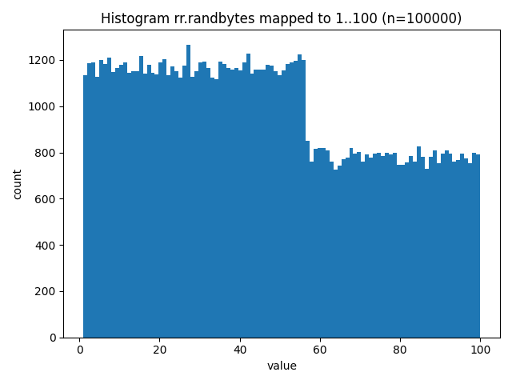
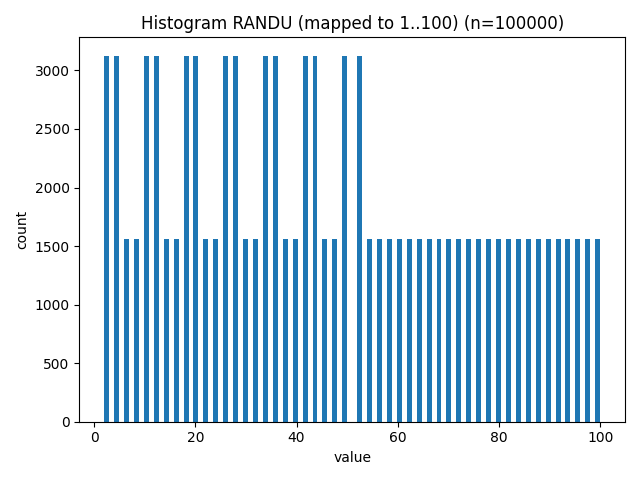

# Randomness Comparison Report

- Date: 2026-02-24T09:05:37
- Bits (testsuite): 1000000
- Histogram samples: 100000 (range 1..100)

## Summary

- randomrad passed: **15/15**
- RANDU passed: **5/15**

## Histograms

### randomrad

### RANDU

## Detailed Results

| Test | rr p-value | rr pass | randu p-value | randu pass |
|------|------------|---------|---------------|------------|
| FrequencyTest.monobit_test | 0.8949842917488073 | True | 0.9952127213588718 | True |
| FrequencyTest.block_frequency | 0.012941469952668849 | True | 1.0 | True |
| RunTest.run_test | 0.4179301534709833 | True | 0.9968084989910693 | True |
| RunTest.longest_one_block_test | 0.6368566205429564 | True | 4.40038449436048e-220 | False |
| Matrix.binary_matrix_rank_text | 0.18731739397949734 | True | 0.0 | False |
| SpectralTest.spectral_test | 0.9341778199756322 | True | 0.0 | False |
| TemplateMatching.non_overlapping_test | 0.5874622837494834 | True | 0.0 | False |
| TemplateMatching.overlapping_patterns | 0.9948109076825483 | True | 0.0 | False |
| Universal.statistical_test | 0.21930266598737147 | True | 0.0 | False |
| ComplexityTest.linear_complexity_test | 0.6557069957991453 | True | 4.407879841957474e-21 | False |
| Serial.serial_test[0] | 0.6890427370014626 | True | 0.0 | False |
| Serial.serial_test[1] | 0.8375131520063976 | True | 0.0 | False |
| ApproximateEntropy.approximate_entropy_test | 0.7984726914042735 | True | 0.0 | False |
| CumulativeSums.forward | 0.812075726791476 | True | 0.9999999999999982 | True |
| CumulativeSums.backward | 0.827157404984876 | True | 1.0 | True |

## Interpretation

Tests with p-value < 0.01 are typically considered failures.
A significantly lower pass count indicates weaker statistical quality.

Histograms are only a quick 1D sanity check. They do not detect many
forms of correlation or structure that the statistical tests can detect.