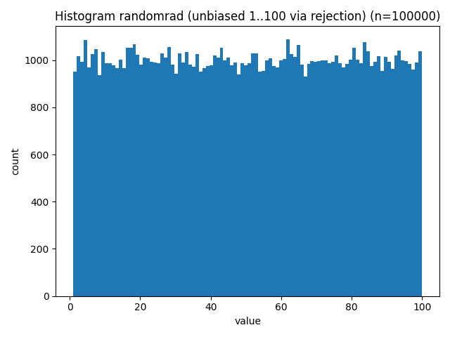
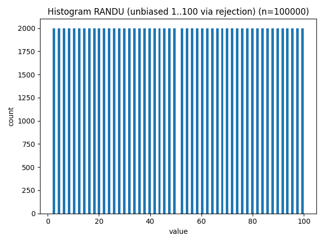
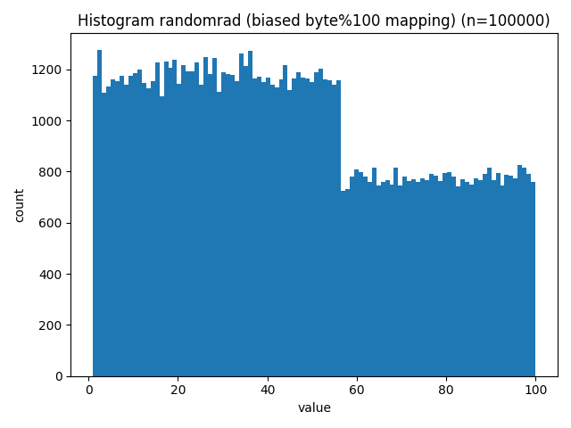
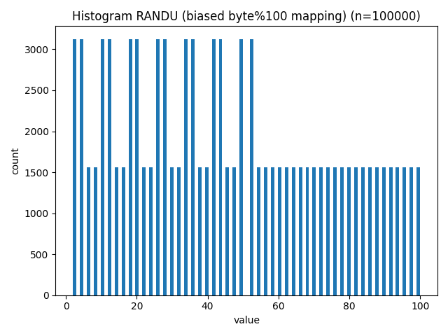

# Randomness Comparison Report

- Date: 2026-02-24T13:48:09
- Bits (testsuite): 8192
- Histogram samples: 100000 (range 1..100)

## Summary

- randomrad passed: **13/15**
- RANDU passed: **8/15**

## Histograms (Unbiased / Fair Mapping)

These histograms use rejection sampling to map bytes to 1..100 without modulo bias (accept only bytes < 200, then (b % 100) + 1).

### randomrad (unbiased)

### RANDU (unbiased)

## Histograms (Biased Mapping / Structure Amplifier)

These histograms use the fast mapping (byte % 100) + 1. This is intentionally biased because 256 is not divisible by 100, so values 1..56 occur slightly more often even for a perfect RNG. It can be useful as a quick 'structure amplifier' (especially for weak generators), but it is not a fair uniformity check.

### randomrad (biased)

### RANDU (biased)

## Detailed Results

| Test | rr p-value | rr pass | randu p-value | randu pass |
|------|------------|---------|---------------|------------|
| FrequencyTest.monobit_test | 0.8079527542652444 | True | 1.0 | True |
| FrequencyTest.block_frequency | 0.2128671178128866 | True | 0.9999999977943732 | True |
| RunTest.run_test | 0.9818496748550908 | True | 1.0 | True |
| RunTest.longest_one_block_test | 0.48751005298024697 | True | 0.00011613343127097583 | False |
| Matrix.binary_matrix_rank_text | 0.40481162159014605 | True | 5.467945686597977e-12 | False |
| SpectralTest.spectral_test | 0.25614496660353436 | True | 0.002516303686452148 | False |
| TemplateMatching.non_overlapping_test | 0.7389653854302539 | True | 0.038387410106223964 | True |
| TemplateMatching.overlapping_patterns | 0.21221265379161114 | True | 0.03440649237291064 | True |
| Universal.statistical_test | -1.0 | None | -1.0 | None |
| ComplexityTest.linear_complexity_test | 0.7438504825576608 | True | 0.9673111261517487 | True |
| Serial.serial_test[0] | 0.9294624199211037 | True | 0.0 | False |
| Serial.serial_test[1] | 0.9602274832835306 | True | 0.0 | False |
| ApproximateEntropy.approximate_entropy_test | 0.0001671835369763792 | False | 0.0 | False |
| CumulativeSums.forward | 0.9602165719598474 | True | 0.9999999999999998 | True |
| CumulativeSums.backward | 0.8285203588245169 | True | 0.9999999999999998 | True |

## Interpretation

Tests with p-value < 0.01 are typically considered failures.
A significantly lower pass count indicates weaker statistical quality.

Histograms are only a quick 1D sanity check. They do not detect many
forms of correlation or structure that the statistical tests can detect.